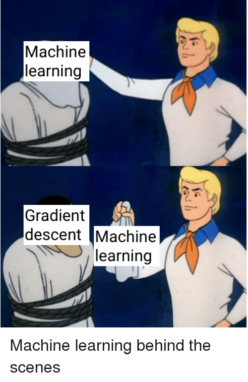

# Optimization Methods for Data Science

Disclaimer: This is work in progress!

This repo contains the material used for the lecture with the name as in the title, being taught at the University of Vienna in the winter semester of 21.

## Links

- Details regarding assessment can be found on [ufind](https://ufind.univie.ac.at/en/course.html?lv=053612&semester=2021W).
- The corresponding **moodle** course can be found [here](https://moodle.univie.ac.at/course/view.php?id=264643).
  Note that this can only be accessed if you are registered for the course. It contains
  + the BigBlueButton link for the live stream
  + the recordings of the lectures
  + a link to rocket-chat channel which can be used as a forum

- find all the **exercises** [here](https://github.com/AxelBohm/optimization-for-DS-lecture/tree/main/exercises)
- instructions and possible topics for the **project** are [here](https://github.com/AxelBohm/optimization-for-DS-lecture/tree/main/project)

## Contribution

If you find typos or even ways to improve readability or formatting, please feel free to make a pull request. 

## Extra awards

Extra credit toward your grade and (more importantly) a certificate will be given to

- who contributes the most to this repo
- the person with the tidiest solutions of the weekly exercises

as well as the team with

- the **cleanest code** in their project
- the **most creative** project

## The motto of this course

  

## Related Literature

- [Convex Optimization: Algorithms and Complexity](https://arxiv.org/pdf/1405.4980.pdf) by Sébastien Bubeck (free online)

- [Introductory Lectures on Convex Programming](https://citeseerx.ist.psu.edu/viewdoc/download?doi=10.1.1.693.855&rep=rep1&type=pdf) by Yurii Nesterov

- [Poster](https://www.cs.ubc.ca/~schmidtm/Documents/2014_NIPSw_GaussSouthwell.pdf) and [paper](http://proceedings.mlr.press/v37/nutini15.pdf) on Coordinate Descent by Schmidt et al.